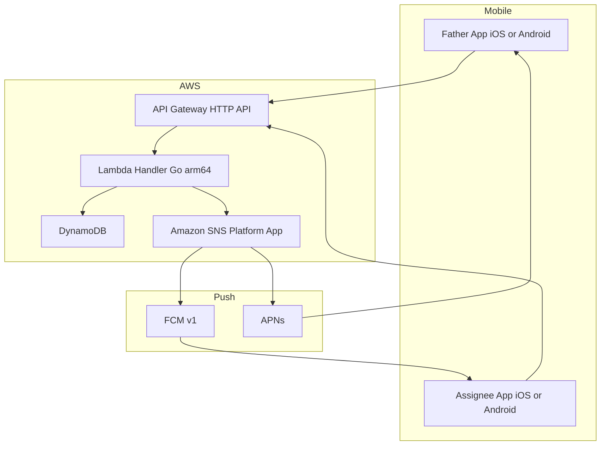
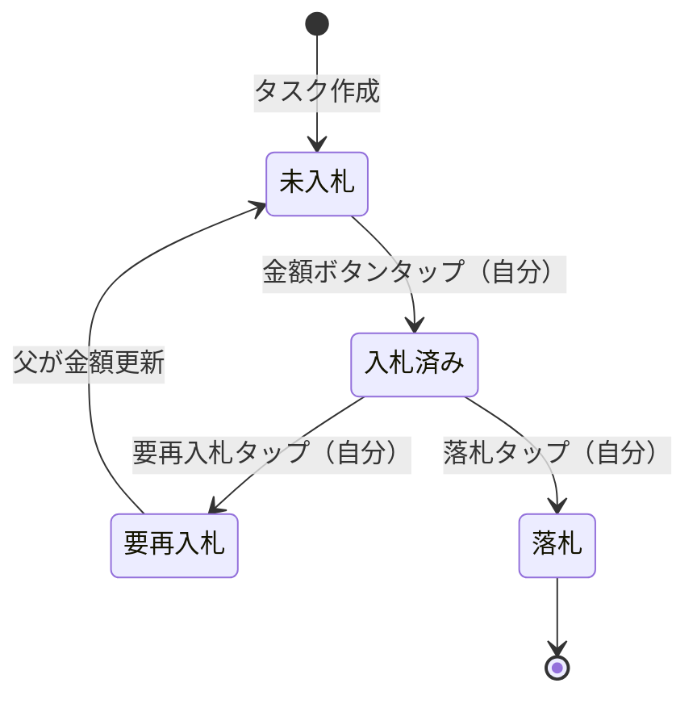
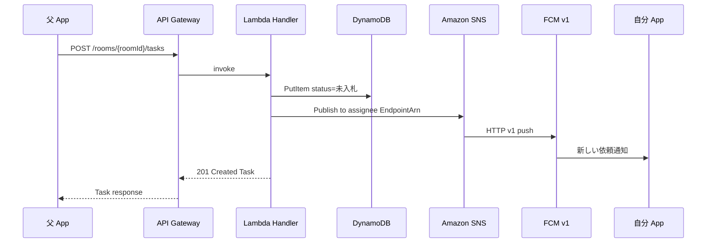

# 技術設計書

## Overview

本機能は、父と自分の2人専用のオークション入札代行管理アプリを実現する。父がヤフオクのURLと希望金額を投稿し、自分が入札を代行してステータスを1タップで報告する。招待コードによるルーム接続で認証不要を実現し、プッシュ通知でアプリを開かずに進捗が伝わる。

**Users**: 父（依頼者・タスク作成者）と自分（入札代行者・ステータス更新者）の2名固定。
**Impact**: サーバーレス構成（Lambda + DynamoDB）により、インフラ管理ゼロで個人使いレベルの運用を実現する。

### Goals
- 1タップでステータスを報告できること（要再入札・入札済みのループ）
- 招待コード接続が永続し、アプリ再起動後も再入力不要
- ステータス変更時にプッシュ通知が届くこと

### Non-Goals
- Yahoo Auction API連携（Req 2.4 / 3.6）：**2020年1月にAPI終了済み。デファード。** ヤフオクURLはタップでブラウザ起動するディープリンクとして保持。
- ユーザー認証（ルームIDが共有シークレット）
- 3人以上のユーザー対応
- 自動入札・スクレイピング（ToS違反リスク）

---

## Architecture

### Architecture Pattern & Boundary Map



- **Selected pattern**: Serverless REST（Lambda + API Gateway HTTP API）
- **Domain boundaries**: Mobile client / HTTP API boundary / Lambda handler / DynamoDB / SNS
- **Notification**: TaskHandler publishes to SNS directly after DynamoDB write（DynamoDB Streams 不使用。詳細は research.md 参照）

### Technology Stack

| Layer | Choice / Version | Role | Notes |
|-------|-----------------|------|-------|
| Frontend | React Native (Expo SDK 52+) + TypeScript | モバイルUI（iOS/Android） | expo-notifications でFCMトークン取得 |
| Backend | Go 1.23 + aws-lambda-go v1 | Lambda ハンドラー | `provided.al2023` ランタイム、ARM64 |
| API | API Gateway HTTP API | RESTエンドポイント公開 | CORS設定あり |
| Data | DynamoDB (on-demand) | ルーム・タスク永続化 | 無料枠 25GB / 25 RCU+WCU |
| Messaging | Amazon SNS + FCM v1 / APNs | プッシュ通知配信 | Service Account JSON認証 |
| IaC | AWS CDK v2 (TypeScript) | インフラ定義 | Lambda: `Runtime.PROVIDED_AL2023`, `Architecture.ARM_64` |

---

## System Flows

### ステータス状態遷移



遷移ルール：`未入札 → 入札済み → 要再入札 → 未入札` のループを繰り返し可。父が金額更新するとステータスは `未入札` にリセットされる。

### タスク作成とプッシュ通知フロー



---

## Requirements Traceability

| 要件 | 概要 | コンポーネント | インターフェース | フロー |
|------|------|--------------|----------------|-------|
| 1.1 | ルーム作成・コード表示 | RoomHandler | POST /rooms | — |
| 1.2 | 招待コードでルーム参加 | RoomHandler | POST /rooms/{id}/join | — |
| 1.3 | 接続永続化（再起動後も維持） | Mobile RoomStore | AsyncStorage保存 | — |
| 1.4 | 無効コードエラー表示 | RoomHandler | 404 response | — |
| 2.1 | タスク作成フォーム表示 | CreateTaskScreen | — | — |
| 2.2 | URL + 金額バリデーション | TaskHandler | POST /rooms/{id}/tasks | — |
| 2.3 | タスク作成時プッシュ通知 | TaskHandler → SNS | Notification Event | タスク作成フロー |
| 2.4 | ヤフオクAPI連携 | **デファード** | — | API終了済み |
| 3.1 | 金額ボタン表示 | TaskDetailScreen | — | — |
| 3.2 | 金額タップで入札済みに更新 | TaskHandler | PATCH /rooms/{id}/tasks/{id} | ステータス遷移 |
| 3.3 | 要再入札タップ → 父に通知 | TaskHandler → SNS | PATCH + Notification | ステータス遷移 |
| 3.4 | 落札タップ → 父に通知 | TaskHandler → SNS | PATCH + Notification | ステータス遷移 |
| 3.5 | ステータスループ許可 | TaskHandler | 状態遷移バリデーション | ステータス遷移 |
| 3.6 | 最高入札中バッジ | **デファード** | — | API終了済み |
| 4.1 | タスク一覧表示 | TaskListScreen | GET /rooms/{id}/tasks | — |
| 4.2 | 複数進捗表示（単一担当者） | TaskDetailScreen | GET + statusHistory | — |
| 4.3 | ステータス色分け表示 | TaskListScreen | — | — |
| 4.4 | 父が金額更新 → 未入札リセット | TaskHandler | PATCH /rooms/{id}/tasks/{id}/amount | ステータス遷移 |
| 5.1 | タスク作成時通知（担当者へ） | TaskHandler → SNS | Notification | タスク作成フロー |
| 5.2 | 要再入札時通知（父へ） | TaskHandler → SNS | Notification | ステータス遷移 |
| 5.3 | 落札時通知（父へ） | TaskHandler → SNS | Notification | ステータス遷移 |
| 5.4 | 通知タップでタスク詳細遷移 | Mobile NotificationHandler | expo-notifications | — |

---

## Components and Interfaces

### Components Summary

| Component | Layer | Intent | Req Coverage | Key Dependencies |
|-----------|-------|--------|--------------|-----------------|
| RoomHandler | Backend | ルーム作成・参加・トークン更新 | 1.1–1.4 | DynamoDB (P0) |
| TaskHandler | Backend | タスクCRUD・ステータス遷移・通知発行 | 2.1–2.3, 3.1–3.5, 4.4, 5.1–5.3 | DynamoDB (P0), SNS (P1) |
| TaskListScreen | Frontend | タスク一覧・ポーリング | 4.1, 4.3 | TaskHandler API (P0) |
| TaskDetailScreen | Frontend | タスク詳細・ステータス更新ボタン | 3.1–3.5, 4.2 | TaskHandler API (P0) |
| CreateTaskScreen | Frontend | タスク作成フォーム | 2.1–2.3 | TaskHandler API (P0) |
| RoomScreen | Frontend | 招待コード生成・入力 | 1.1–1.4 | RoomHandler API (P0) |
| NotificationHandler | Frontend | プッシュ通知受信・画面遷移 | 5.4 | expo-notifications (P0) |

---

### Backend

#### RoomHandler

| Field | Detail |
|-------|--------|
| Intent | ルームの作成・参加・デバイストークン更新を担う |
| Requirements | 1.1, 1.2, 1.3, 1.4 |

**Responsibilities & Constraints**
- ルームID（6文字英数字）を生成し DynamoDB に永続化する
- 招待コード入力時に存在チェックを行い、存在しない場合は 404 を返す
- デバイストークンをロール（`father` / `assignee`）ごとに保存・更新する
- 1ルーム2名固定。3名目の参加要求は 409 で拒否する

**Dependencies**
- Outbound: DynamoDB `rooms` table — ルーム永続化 (P0)

**Contracts**: API [x]

##### API Contract

| Method | Endpoint | Request | Response | Errors |
|--------|----------|---------|----------|--------|
| POST | /rooms | `{}` | `RoomResponse` | 500 |
| POST | /rooms/{roomId}/join | `JoinRoomRequest` | `JoinRoomResponse` | 404, 409 |
| PATCH | /rooms/{roomId}/token | `UpdateTokenRequest` | `{ success: true }` | 404 |

**Implementation Notes**
- Validation: roomId パスパラメータは 6文字英数字正規表現で検証
- Risks: デバイストークンが古くなった場合、SNS Publish は silent fail（2ユーザーなので許容）

---

#### TaskHandler

| Field | Detail |
|-------|--------|
| Intent | タスクのCRUD・ステータス遷移バリデーション・プッシュ通知発行 |
| Requirements | 2.2, 2.3, 3.2–3.5, 4.4, 5.1–5.3 |

**Responsibilities & Constraints**
- タスク作成時に `status: 未入札` で初期化し、作成者と反対ロールのデバイストークンへ SNS Publish する
- ステータス遷移は定義済み遷移マップに従い、不正遷移は 422 を返す
- `requestedAmount` 更新時は `status` を `未入札` にリセットし、担当者に通知する
- DynamoDB への書き込み後に SNS Publish する（書き込み失敗時は通知しない）

**Dependencies**
- Outbound: DynamoDB `tasks` table — タスク永続化 (P0)
- Outbound: DynamoDB `rooms` table — 通知先 EndpointArn 取得 (P0)
- Outbound: Amazon SNS — プッシュ通知発行 (P1)

**Contracts**: API [x]

##### API Contract

| Method | Endpoint | Request | Response | Errors |
|--------|----------|---------|----------|--------|
| GET | /rooms/{roomId}/tasks | — | `TaskListResponse` | 404 |
| POST | /rooms/{roomId}/tasks | `CreateTaskRequest` | `TaskResponse` | 400, 404 |
| PATCH | /rooms/{roomId}/tasks/{taskId} | `UpdateTaskStatusRequest` | `TaskResponse` | 400, 404, 422 |
| PATCH | /rooms/{roomId}/tasks/{taskId}/amount | `UpdateTaskAmountRequest` | `TaskResponse` | 400, 404 |

**State Transition Map** (422 if violated):

| 現在のステータス | 許可される次ステータス |
|----------------|----------------------|
| 未入札 | 入札済み |
| 入札済み | 要再入札, 落札 |
| 要再入札 | 入札済み |
| 落札 | なし（終端） |

**Implementation Notes**
- `requestedAmount` 更新は専用エンドポイントで行い、ステータスリセットと通知をアトミックに処理する
- SNS Publish 失敗はログ記録のみ（タスク更新は成功扱い）
- Risks: DynamoDB write と SNS Publish の間に障害が発生した場合、通知が届かない可能性がある（許容：2ユーザーが次回ポーリングで確認可能）

---

### Frontend

#### TaskListScreen

| Field | Detail |
|-------|--------|
| Intent | タスク一覧を30秒ポーリングで更新し、ステータスを色分け表示する |
| Requirements | 4.1, 4.3 |

**Contracts**: State [x]

##### State Management
- State model: `tasks: Task[]`, `loading: boolean`, `error: string | null`
- Persistence: ポーリング（30秒間隔）。`useEffect` + `setInterval` で実装
- Concurrency: 前のリクエストが未完了の場合はスキップ

**Implementation Notes**
- ステータスカラー定数: `未入札=gray`, `入札済み=blue`, `要再入札=orange`, `落札=green`
- タスク行タップで `TaskDetailScreen` にナビゲート

---

#### TaskDetailScreen

**Requirements**: 3.1–3.5, 4.2 — タスク詳細表示・金額ボタン・要再入札ボタン・落札ボタンを提供する。ボタンタップで `PATCH /rooms/{id}/tasks/{id}` を呼び出し、レスポンスでローカル状態を更新する。

---

#### NotificationHandler（Frontend Service）

**Requirements**: 5.4 — `expo-notifications` の `addNotificationResponseReceivedListener` でタップイベントを受け取り、ペイロード内 `taskId` を用いて `TaskDetailScreen` へナビゲートする。アプリ起動時に FCM トークンを取得し `PATCH /rooms/{roomId}/token` で登録・更新する。

---

## Data Models

### Domain Model

- **Room**: 招待コード（ルームID）を識別子とするアグリゲートルート。2名のデバイストークンを保持する。
- **Task**: ルームに属するエンティティ。ステータス遷移の履歴を値オブジェクト `StatusEntry` のリストとして持つ。`requestedAmount` 更新はドメインイベントとしてステータスをリセットする。

### Logical Data Model

```mermaid
erDiagram
    ROOM {
        string roomId PK
        map memberTokens
        string createdAt
    }
    TASK {
        string roomId PK
        string taskId SK
        string auctionUrl
        number requestedAmount
        string status
        number bidAmount
        list statusHistory
        string createdAt
        string updatedAt
    }
    ROOM ||--o{ TASK : contains
```

### Physical Data Model（DynamoDB）

**rooms テーブル**

| 属性 | 型 | 説明 |
|------|-----|------|
| `roomId` | S (PK) | 6文字英数字 |
| `memberTokens` | M | `{ father: string, assignee: string }` |
| `createdAt` | S | ISO8601 |

**tasks テーブル**

| 属性 | 型 | 説明 |
|------|-----|------|
| `roomId` | S (PK) | ルームID |
| `taskId` | S (SK) | ULID（時系列ソート可） |
| `auctionUrl` | S | ヤフオクURL |
| `requestedAmount` | N | 希望入札金額（円） |
| `status` | S | TaskStatus enum |
| `bidAmount` | N (optional) | 実際に入札した金額 |
| `statusHistory` | L | `{ status, amount?, timestamp }` のリスト |
| `createdAt` | S | ISO8601 |
| `updatedAt` | S | ISO8601 |

アクセスパターン: `roomId` でタスク一覧取得（PK条件クエリ）のみ。GSI不要。

### Data Contracts

#### TypeScript 型定義

```typescript
type TaskStatus = "未入札" | "入札済み" | "要再入札" | "落札";
type Role = "father" | "assignee";

interface StatusEntry {
  status: TaskStatus;
  amount: number | null;
  timestamp: string; // ISO8601
}

interface Task {
  taskId: string;       // ULID
  roomId: string;
  auctionUrl: string;
  requestedAmount: number;
  status: TaskStatus;
  bidAmount: number | null;
  statusHistory: StatusEntry[];
  createdAt: string;
  updatedAt: string;
}

interface CreateTaskRequest {
  auctionUrl: string;
  requestedAmount: number;
}

interface UpdateTaskStatusRequest {
  status: TaskStatus;
  bidAmount?: number;
}

interface UpdateTaskAmountRequest {
  requestedAmount: number;
}

interface JoinRoomRequest {
  deviceToken: string;
  role: Role;
}

interface UpdateTokenRequest {
  role: Role;
  deviceToken: string;
}

type ApiResult<T> =
  | { data: T; error: null }
  | { data: null; error: { code: string; message: string } };
```

#### SNS Notification Payload

```json
{
  "fcmV1Message": {
    "notification": {
      "title": "入札代行アプリ",
      "body": "ステータスが更新されました"
    },
    "data": {
      "roomId": "ABC123",
      "taskId": "01JXXXX..."
    }
  }
}
```

---

## Error Handling

### Error Strategy

**User Errors (4xx)**
- `400 Bad Request`: 必須フィールド欠損・型不正 → フィールドレベルのエラーメッセージを返す
- `404 Not Found`: roomId / taskId 不存在 → "ルームまたはタスクが見つかりません"
- `409 Conflict`: 3名目の参加試行 → "このルームは既に2名が参加しています"
- `422 Unprocessable Entity`: 不正なステータス遷移 → "このステータスには変更できません"

**System Errors (5xx)**
- `500 Internal Server Error`: DynamoDB / SNS 障害 → ログ記録、ユーザーには汎用エラーメッセージ

**SNS Publish 失敗**: ログのみ、タスク更新は成功扱い。

### Monitoring

- Lambda: CloudWatch Logs（構造化JSON） + CloudWatch Metrics（エラー率・レイテンシ）
- DynamoDB: CloudWatch Metrics（ConsumedCapacity・SystemErrors）
- アラート: `Lambda Errors > 0` で CloudWatch Alarm → SNS メール通知

---

## Testing Strategy

- **Unit Tests**: TaskHandler のステータス遷移バリデーション（全パターン）; RoomHandler の roomId 生成・重複チェック
- **Integration Tests**: POST /rooms → POST /rooms/{id}/join → POST /rooms/{id}/tasks → PATCH status のE2Eシナリオ（LocalStack使用）
- **E2E / UI Tests**: タスク作成フォームのバリデーション表示; ステータスボタンタップ → UIリフレッシュ確認
- **Push Notification Tests**: SNS Publish 呼び出しをモックして Handler のレスポンスを検証

---

## Security Considerations

- **ルームID推測対策**: `/rooms/{id}/join` は5回/分/IPを超えると 429 を返す（API Gateway スロットリング）
- **デバイストークン保護**: DynamoDB への保存のみ。レスポンスボディには含めない
- **HTTPS強制**: API Gateway はHTTPS only
- **機密情報**: Service Account JSON は AWS Secrets Manager に保存し、Lambda 実行ロールで参照
