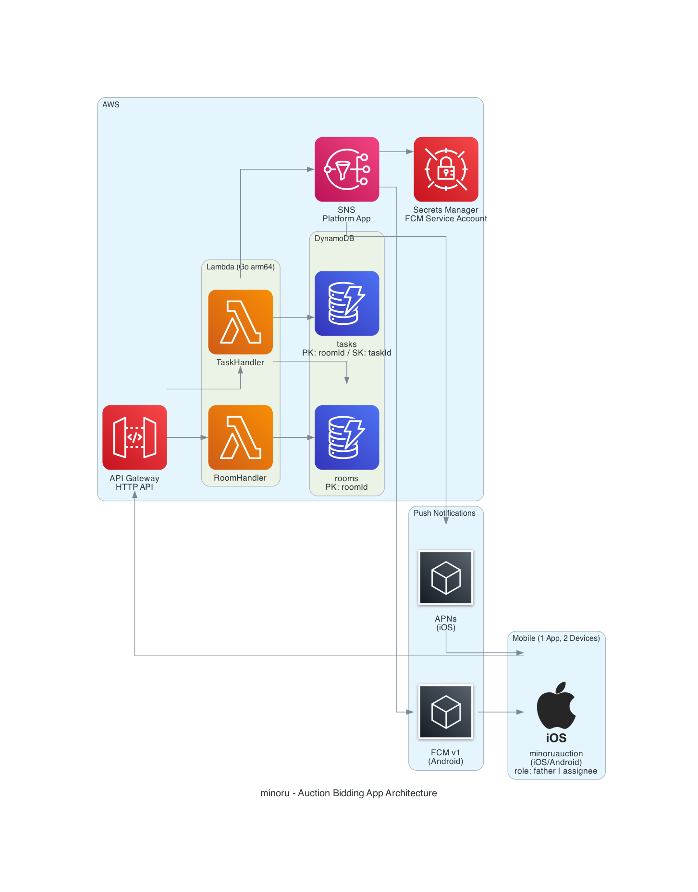

# Architecture



---

## Overview

父と自分の2人専用オークション入札代行アプリ。招待コード（ルームID）でペアリングし、プッシュ通知でリアルタイムに連携する。

## Components

### Mobile
| Component | 詳細 |
|---|---|
| minoruauction | 1つのアプリを父・自分の2台にインストール。参加時に選んだ **role（father / assignee）** によって操作が変わる |

### AWS
| Component | 詳細 |
|---|---|
| API Gateway HTTP API | REST エンドポイント公開。HTTPS only |
| Lambda (Go arm64) | RoomHandler / TaskHandler。`provided.al2023` ランタイム |
| DynamoDB (on-demand) | rooms テーブル（PK: roomId）/ tasks テーブル（PK: roomId, SK: taskId） |
| SNS Platform App | FCM v1 / APNs へのプッシュ通知配信 |
| Secrets Manager | FCM Service Account JSON を保管 |

### Push
| Component | 詳細 |
|---|---|
| FCM v1 | Android 向けプッシュ通知 |
| APNs | iOS 向けプッシュ通知 |

---

## API Endpoints

### RoomHandler
| Method | Path | Description |
|---|---|---|
| POST | `/rooms` | ルーム作成（6文字コード生成） |
| POST | `/rooms/{roomId}/join` | 招待コードでルーム参加 |
| PATCH | `/rooms/{roomId}/token` | デバイストークン更新 |

### TaskHandler
| Method | Path | Description |
|---|---|---|
| GET | `/rooms/{roomId}/tasks` | タスク一覧取得 |
| POST | `/rooms/{roomId}/tasks` | タスク作成（status: 未入札） |
| PATCH | `/rooms/{roomId}/tasks/{taskId}` | ステータス更新 |
| PATCH | `/rooms/{roomId}/tasks/{taskId}/amount` | 希望金額更新（未入札リセット） |

---

## Status Transitions

```
未入札 ──→ 入札済み ──→ 要再入札 ──→ 入札済み（ループ）
                   └──→ 落札（終端）
```

父が金額更新すると `未入札` にリセットされる。

---

## Data Models

### rooms テーブル
| 属性 | 型 | 説明 |
|---|---|---|
| `roomId` | PK (S) | 6文字英数字 |
| `memberTokens` | M | `{ father: token, assignee: token }` |
| `createdAt` | S | ISO8601 |

### tasks テーブル
| 属性 | 型 | 説明 |
|---|---|---|
| `roomId` | PK (S) | ルームID |
| `taskId` | SK (S) | ULID（時系列ソート可） |
| `auctionUrl` | S | ヤフオクURL |
| `requestedAmount` | N | 希望入札金額（円） |
| `status` | S | TaskStatus enum |
| `bidAmount` | N (opt) | 実際の入札金額 |
| `statusHistory` | L | `{ status, amount?, timestamp }` のリスト |
| `createdAt` | S | ISO8601 |
| `updatedAt` | S | ISO8601 |
